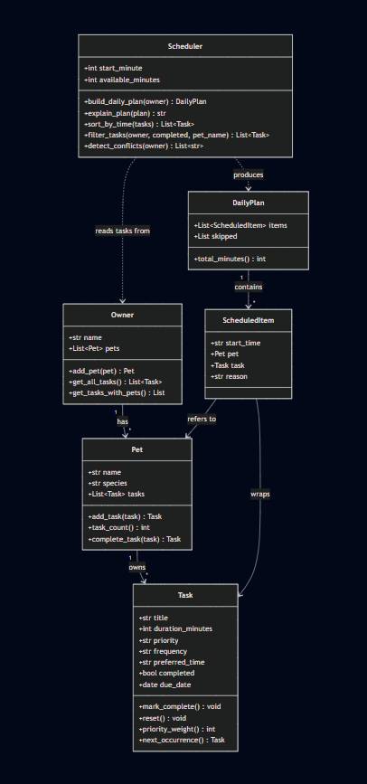
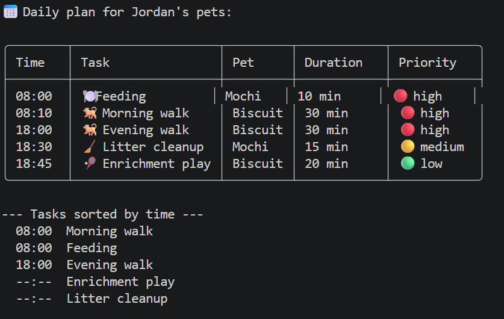
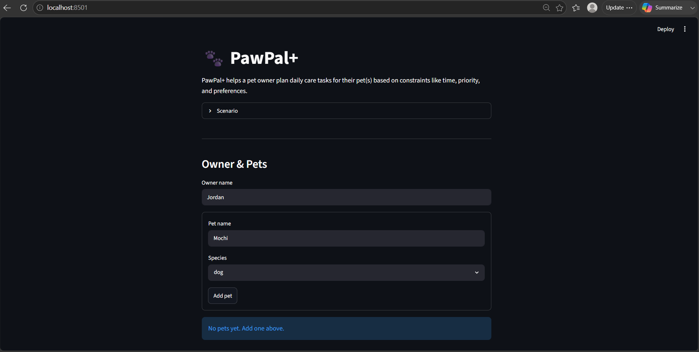

# PawPal+ (Module 2 Project)

You are building **PawPal+**, a Streamlit app that helps a pet owner plan care tasks for their pet.

## Scenario

A busy pet owner needs help staying consistent with pet care. They want an assistant that can:

- Track pet care tasks (walks, feeding, meds, enrichment, grooming, etc.)
- Consider constraints (time available, priority, owner preferences)
- Produce a daily plan and explain why it chose that plan

Your job is to design the system first (UML), then implement the logic in Python, then connect it to the Streamlit UI.

## What you will build

## ✨ Features

- **Priority-aware planning** — schedules high-priority care before low-priority enrichment.
- **Time-budget packing** — fits tasks into the minutes you have; skips overflow with a reason.
- **Sort by time** — view tasks chronologically (`Scheduler.sort_by_time`).
- **Filtering** — by pet or completion status (`Scheduler.filter_tasks`).
- **Conflict warnings** — flags tasks scheduled at the same time (`Scheduler.detect_conflicts`).
- **Recurring tasks** — completing a daily/weekly task auto-creates its next occurrence.
- **Explainable plans** — every scheduled item includes a one-line reason.

## 🎨 Output Formatting

The CLI demo (`main.py`) renders the daily plan as a boxed table using the **tabulate** library (`tablefmt="rounded_outline"`). Helper functions add visual cues:
- `task_emoji(title)` — picks an emoji from the task title (🐕 walk, 🍽️ feed, 💊 med, 🛁 groom, 🎾 play, 🧹 litter).
- `PRIORITY_EMOJI` — color dots for priority (🔴 high, 🟡 medium, 🟢 low).

This makes the schedule scannable at a glance instead of a flat text list.


## Getting started

### Setup

```bash
python -m venv .venv
source .venv/bin/activate  # Windows: .venv\Scripts\activate
pip install -r requirements.txt
```

### Suggested workflow

1. Read the scenario carefully and identify requirements and edge cases.
2. Draft a UML diagram (classes, attributes, methods, relationships).
3. Convert UML into Python class stubs (no logic yet).
4. Implement scheduling logic in small increments.
5. Add tests to verify key behaviors.
6. Connect your logic to the Streamlit UI in `app.py`.
7. Refine UML so it matches what you actually built.

## 🖥️ Sample Output

Output from running `python main.py`:

```
Daily plan for Jordan's pets:

08:00 — Feeding (10 min) for Mochi [priority: high] — high priority, owner asked for ~08:00.
08:10 — Morning walk (30 min) for Biscuit [priority: high] — high priority, owner asked for ~08:00.
18:00 — Evening walk (30 min) for Biscuit [priority: high] — high priority, owner asked for ~18:00.
18:30 — Litter cleanup (15 min) for Mochi [priority: medium] — medium priority, slotted in next available time.
18:45 — Enrichment play (20 min) for Biscuit [priority: low] — low priority, slotted in next available time.

--- Tasks sorted by time ---
  08:00  Morning walk
  08:00  Feeding
  18:00  Evening walk
  --:--  Enrichment play
  --:--  Litter cleanup

--- High-detail filters ---
Biscuit's tasks: ['Evening walk', 'Morning walk', 'Enrichment play']

--- Conflicts ---
Conflict at 08:00: Morning walk (Biscuit), Feeding (Mochi)

--- Recurring task demo ---
Completed 'Morning walk'. Tasks went 3 -> 4. Next due: 2026-06-30
```


## 🧪 Testing PawPal+

Run the full test suite with:

```bash
python -m pytest
```

The suite covers task completion, task counting, schedule ordering by priority,
time-budget skipping, chronological sorting, untimed-task ordering, daily/weekly
recurrence, conflict detection, filtering by pet, and the empty-pet edge case.

```
============================= test session starts =============================
platform win32 -- Python 3.11.9, pytest-9.0.3, pluggy-1.6.0
rootdir: C:\Users\shire\Documents\CodePathOrg\AI\ai110-module2show-pawpal-starter
plugins: anyio-4.11.0
collected 12 items

tests/test_pawpal.py::test_mark_complete_changes_status PASSED           [  8%]
tests/test_pawpal.py::test_adding_task_increases_pet_task_count PASSED   [ 16%]
tests/test_pawpal.py::test_scheduler_orders_high_priority_first PASSED   [ 25%]
tests/test_pawpal.py::test_scheduler_skips_tasks_that_do_not_fit PASSED  [ 33%]
tests/test_pawpal.py::test_sort_by_time_orders_chronologically PASSED    [ 41%]
tests/test_pawpal.py::test_untimed_tasks_sort_last PASSED                [ 50%]
tests/test_pawpal.py::test_completing_daily_task_creates_next_day_occurrence PASSED [ 58%]
tests/test_pawpal.py::test_completing_weekly_task_advances_one_week PASSED [ 66%]
tests/test_pawpal.py::test_detect_conflicts_flags_same_time PASSED       [ 75%]
tests/test_pawpal.py::test_no_conflict_when_times_differ PASSED          [ 83%]
tests/test_pawpal.py::test_filter_tasks_by_pet_name PASSED               [ 91%]
tests/test_pawpal.py::test_pet_with_no_tasks_produces_empty_plan PASSED  [100%]

============================= 12 passed in 0.04s ==============================
```

**Confidence level:** ⭐⭐⭐⭐☆ (4/5) — core scheduling, recurrence, and conflict
logic are well covered. Next I'd add tests for overlapping-duration conflicts and
multi-day recurrence streaks.

## 📐 Smarter Scheduling

| Feature | Method(s) | Notes |
|---------|-----------|-------|
| Task sorting | `Scheduler.sort_by_time()` | Sorts by `preferred_time` ("HH:MM"); untimed tasks go last |
| Filtering | `Scheduler.filter_tasks()` | Filter by pet name and/or completion status |
| Conflict handling | `Scheduler.detect_conflicts()` | Warns on tasks sharing the same `preferred_time` (exact match) |
| Recurring tasks | `Task.next_occurrence()`, `Pet.complete_task()` | Completing a daily/weekly task creates the next occurrence via `timedelta` |

## 📸 Demo Walkthrough

PawPal+ runs as a Streamlit app (`python -m streamlit run app.py`).

**What you can do:**
- Set the owner name and add one or more pets (name + species).
- Add care tasks to a chosen pet: title, duration, priority, and an optional preferred time.
- See all current tasks in a table, and a "sorted by time" view.
- Generate a daily schedule and read why each task was placed where it was.

**Example workflow:**
1. Enter owner "Jordan" and add pets **Biscuit** (dog) and **Mochi** (cat).
2. Add tasks: Biscuit "Morning walk" (30 min, high, 08:00) and Mochi "Feeding" (10 min, high, 08:00).
3. Click **Generate schedule**.
4. PawPal+ shows a ⚠️ conflict warning (both want 08:00), then the ordered plan with reasons.
5. Add a low-priority "Enrichment play" and regenerate to see it slotted after the high-priority tasks.

**Scheduler behaviors shown:** priority ordering, preferred-time placement, exact-time conflict warnings, time-budget skipping and per-task reasoning.

**Sample CLI output** (`python main.py`):

UML Diagram:




**Output of Main.py**





**Screenshot or video** *(optional)*: 

